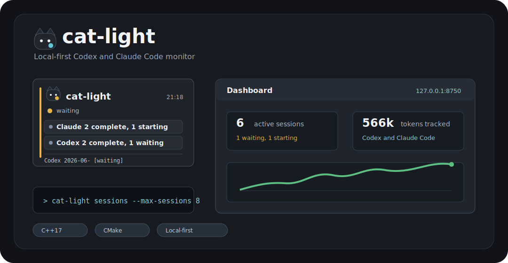

# cat-light

[](https://github.com/Cyaeghas/cat-light/actions/workflows/build.yml)
[](https://github.com/Cyaeghas/cat-light/releases)
[](CMakeLists.txt)
[](CMakePresets.json)
[](.github/workflows/build.yml)

[English](README.md) | 简体中文

`cat-light` 是一个本地优先的 Codex / Claude Code 状态监视器。它关注正在运行的 coding agent 会话、token 用量、上下文压力、hook 状态和历史记录，并通过 CLI、本地 dashboard、Waybar JSON、Windows 托盘和桌面浮标展示出来。

项目使用 C++ 和 CMake。核心程序保持轻依赖和跨平台，原生 GUI 外壳则作为可选目标逐步演进。



## 功能亮点

| 功能 | 说明 |
| --- | --- |
| 系统托盘 | Windows 托盘启动器会守护本地 dashboard 服务，并提供常用操作入口。 |
| 桌面浮标 | 置顶、可拖动的小窗口，用于显示当前 Codex / Claude Code 活动状态，并带有轻量猫耳状态灯识别。 |
| Web dashboard | 本地 `127.0.0.1` 仪表盘，显示会话、历史摘要、趋势和同步操作。 |
| Agent 状态 | 支持每个 provider 的多个会话，状态包括 `thinking`、`working`、`waiting`、`complete` 和 `error`。 |
| Token 与上下文 | 从本地日志提取 token 总量、上下文占用，并保留 quota 状态接口。 |
| 可逆 hook | 支持 Codex `notify` 和 Claude `settings.json`，安装前备份，支持卸载恢复。 |
| 本地历史 | 默认 JSONL，支持可选 bundled SQLite 构建，提供去重事件、趋势桶和汇总。 |

## 为什么做这个

不少现有状态栏工具只关注一个信号：quota、单个 provider 或单个桌面外壳。`cat-light` 想把四类信号合在一个本地工具里：

| 层 | 关注内容 |
| --- | --- |
| 实时状态 | 多个 Codex / Claude Code 会话，以及 `starting`、`thinking`、`working`、`waiting`、`complete`、`error`、`idle`、`stale` 状态。 |
| Token 用量 | 输入、输出、缓存、reasoning 和会话总 token，取决于本地日志可用字段。 |
| 上下文 | 已用上下文、上下文上限、剩余窗口和占用比例。 |
| 历史 | 本地去重事件、每日趋势、provider/model/project 汇总、工具调用和 shell 命令活动。 |

程序读取本地凭据和本地会话日志，不上传 prompt、response、工具输出、文件内容或遥测。

## 当前形态

| 界面 | 状态 | 说明 |
| --- | --- | --- |
| CLI | 可用 | `status`、`json`、`waybar`、`state`、`sessions`、`history`、`sync`、`doctor`。 |
| Hooks | 原型可用 | 可逆安装 Codex `notify` 和 Claude `settings.json` hook。 |
| 本地 dashboard | 原型可用 | 运行在 `127.0.0.1`，显示会话、历史摘要和趋势。 |
| Windows 托盘 | 原型可用 | 启动本地服务并提供快捷操作。 |
| Windows 浮标 | 原型可用 | 置顶桌面小窗口，显示 Codex / Claude 当前活动。 |
| SQLite 后端 | 可选原型 | 已支持 bundled SQLite amalgamation 构建。 |
| 跨平台原生 UI | 计划中 | CopperSpice、Qt、wxWidgets 是后续候选。 |

## 安装

可以从 [GitHub Releases](https://github.com/Cyaeghas/cat-light/releases) 下载预编译二进制，也可以从源码构建。

Windows release 压缩包包含：

```text
cat-light.exe
cat-light-tray.exe
cat-light-float.exe
```

启动桌面浮标：

```powershell
.\cat-light-float.exe
```

Windows 详细安装说明见 [docs/install-windows.md](docs/install-windows.md)。

## 从源码构建

MSVC / Visual Studio：

```powershell
cmake --preset msvc-release
cmake --build --preset msvc-release
```

启用 bundled SQLite：

```powershell
cmake --preset msvc-sqlite
cmake --build --preset msvc-sqlite
```

常用命令：

```powershell
build\msvc-release\Release\cat-light.exe doctor
build\msvc-release\Release\cat-light.exe state
build\msvc-release\Release\cat-light.exe sessions --max-sessions 8
build\msvc-release\Release\cat-light.exe serve --addr 127.0.0.1:8750
```

启动 Windows UI：

```powershell
build\msvc-release\Release\cat-light-tray.exe
build\msvc-release\Release\cat-light-float.exe
```

打开 dashboard：

```text
http://127.0.0.1:8750
```

## 使用方式

### 系统托盘

- 左键：打开本地 dashboard。
- 右键：打开 dashboard、同步历史、查看 hook 状态或退出。
- 托盘程序会在后台启动 `cat-light.exe serve --addr 127.0.0.1:8750`。

### 桌面浮标

- 拖动：移动窗口。
- 双击：打开本地 dashboard。
- 右键：同步、hook 状态、刷新、重置位置、启用/取消开机启动或退出。
- 窗口位置保存在 `%LOCALAPPDATA%\cat-light\float.ini`。

### Dashboard

运行 `serve`、托盘程序或桌面浮标后，可以访问 `http://127.0.0.1:8750`。

## Agent 状态

`cat-light` 会合并 hook、被动 JSONL 扫描和手动事件，得到每个会话的状态。

```powershell
cat-light state
cat-light sessions
cat-light sessions-json
cat-light agent-waybar
cat-light sessions --provider codex --max-sessions 5
```

手动写入事件，适合包装非官方 API 或自定义 launcher：

```powershell
cat-light event --provider codex --session-id demo --state thinking --detail "Thinking"
cat-light event --provider codex --session-id demo --state working --input-tokens 1000 --output-tokens 200 --context-used 1200 --context-limit 200000
```

从 stdin 写入 JSON：

```powershell
'{"provider":"claude","session_id":"demo","state":"working"}' | cat-light event --stdin
```

HTTP 事件入口：

```text
POST http://127.0.0.1:8750/event
GET  http://127.0.0.1:8750/state
GET  http://127.0.0.1:8750/sessions
```

## 数据来源

| 来源 | 路径或接口 | 用途 |
| --- | --- | --- |
| Codex auth | `~/.codex/auth.json` | Codex OAuth token 和 quota 请求。 |
| Codex sessions | `~/.codex/sessions/**/*.jsonl` | 本地会话状态、token、工具调用和命令。 |
| Claude credentials | `~/.claude/.credentials.json` 或 `CLAUDE_CONFIG_DIR` | Claude 用量接口支持。 |
| Claude projects | `~/.claude/projects/**/*.jsonl` | 本地会话状态、token、模型和工具事件。 |
| Hooks | `%LOCALAPPDATA%\cat-light\hooks` | Codex / Claude Code 的显式生命周期事件。 |
| 手动/API 事件 | `cat-light event` 和 `POST /event` | wrapper、非官方 API runner 和自定义 launcher。 |

## 历史与存储

`sync` 会读取手动事件、hook 事件、Codex session JSONL 和 Claude project JSONL，然后写入本地去重历史。

```powershell
cat-light sync --provider all
cat-light sync-json --provider all --storage jsonl
cat-light history --max-sessions 10
cat-light history-json --provider claude
cat-light history-summary
cat-light history-summary-json --provider codex
cat-light history-trends-json --days 30
```

默认 JSONL 存储位于 `%LOCALAPPDATA%\cat-light\history`。SQLite 可以在构建时启用：

```powershell
cmake -S . -B build\msvc-sqlite -G "Visual Studio 17 2022" -A x64 -DCAT_LIGHT_ENABLE_SQLITE=ON
cmake --build build\msvc-sqlite --config Release
```

## Hooks

安装、查看和卸载本机 hook：

```powershell
cat-light hook-install --provider all --shell powershell
cat-light hook-status --provider all
cat-light hook-uninstall --provider all
cat-light hook-install --provider claude --dry-run
cat-light hook-script --provider codex --shell powershell
```

hook 安装流程是可逆的：

- helper 脚本写入 `%LOCALAPPDATA%\cat-light\hooks`。
- 修改 Claude `settings.json` 和 Codex `config.toml` 前会备份。
- Codex 原有 top-level `notify` 会保存在 install manifest，并在卸载时恢复。
- PowerShell helper 会在记录 `cat-light` 事件后尽量继续调用原 Codex notify。

## Waybar

```jsonc
"custom/cat-light": {
  "exec": "cat-light agent-waybar",
  "return-type": "json",
  "interval": 5,
  "tooltip": true
}
```

quota 输出：

```jsonc
"custom/cat-light-quota": {
  "exec": "cat-light waybar",
  "return-type": "json",
  "interval": 300,
  "tooltip": true
}
```

## 参考项目

| 项目 | 对 `cat-light` 的参考价值 |
| --- | --- |
| [Bayern4ever-dot/code-light](https://github.com/Bayern4ever-dot/code-light) | 产品形态：轻量指示器、托盘/浮标、本地 dashboard、状态和 token 用量。 |
| [mryll/codexbar](https://github.com/mryll/codexbar) | Codex auth、OAuth 刷新、quota 接口、缓存回退、Waybar 输出。 |
| [mryll/claudebar](https://github.com/mryll/claudebar) | Claude Code quota 追踪、cache/stale 处理、状态栏展示。 |
| [mm7894215/TokenTracker](https://github.com/mm7894215/TokenTracker) | 本地聚合、hook 安装、SQLite 历史、多工具 token 追踪。 |
| [copperspice/copperspice](https://github.com/copperspice/copperspice) | 未来跨平台 C++ GUI shell 候选，CMake 友好，但更重且偏 C++20。 |

更多对比见 [docs/comparison.md](docs/comparison.md)。

## 路线图

近期：

- 增强 SQLite 查询表，支持 provider、model、project、tool 和 command drilldown。
- 改进 token 到工具/命令的归因。
- 增加更多真实脱敏 Codex / Claude JSONL fixtures。
- 打磨 Windows 浮标和托盘。
- 增加更清晰的安装和打包 release 流程。

长期：

- 跨平台托盘或浮标 UI。
- 更完整的 Claude OAuth refresh 和 quota response 处理。
- 模型价格元数据和估算成本视图。
- 更好的 dashboard 趋势、上下文和会话历史图表。

## 开发

运行 fixture 测试：

```powershell
.\scripts\test-fixtures.ps1
.\scripts\test-fixtures.ps1 -Exe build\msvc-sqlite\Release\cat-light.exe -Storage sqlite
```

相关文档：

- [Windows installation](docs/install-windows.md)
- [Hook contract](docs/hook-contract.md)
- [Storage design](docs/storage.md)
- [Platform roadmap](docs/platform-roadmap.md)
- [Reference comparison](docs/comparison.md)
